# Acad Institute ERP - Architecture Diagrams

## 1. System Architecture (High-Level)

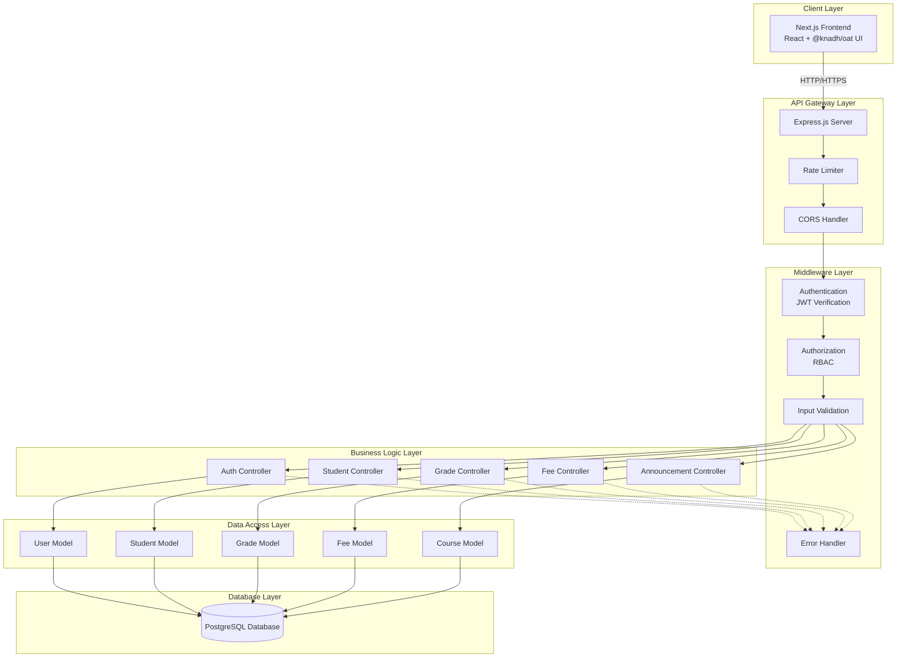

---

## 2. Authentication Flow

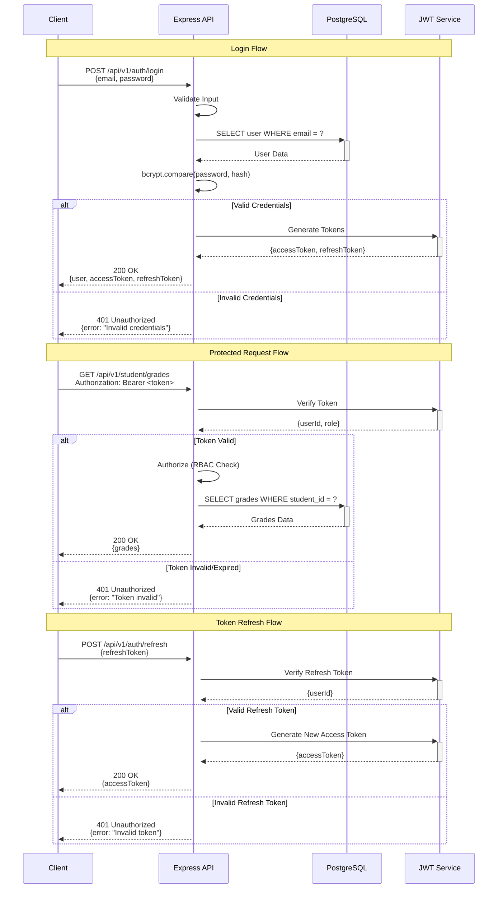

---

## 3. Request Processing Flow

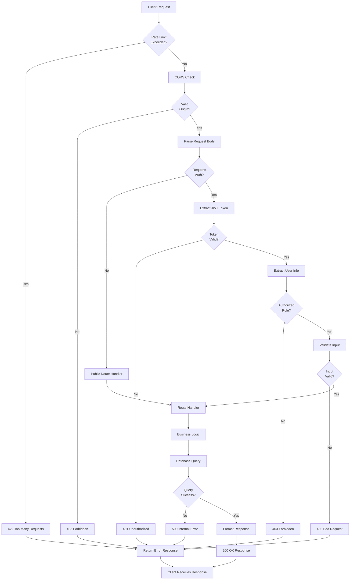

---

## 4. Database Entity Relationship Diagram

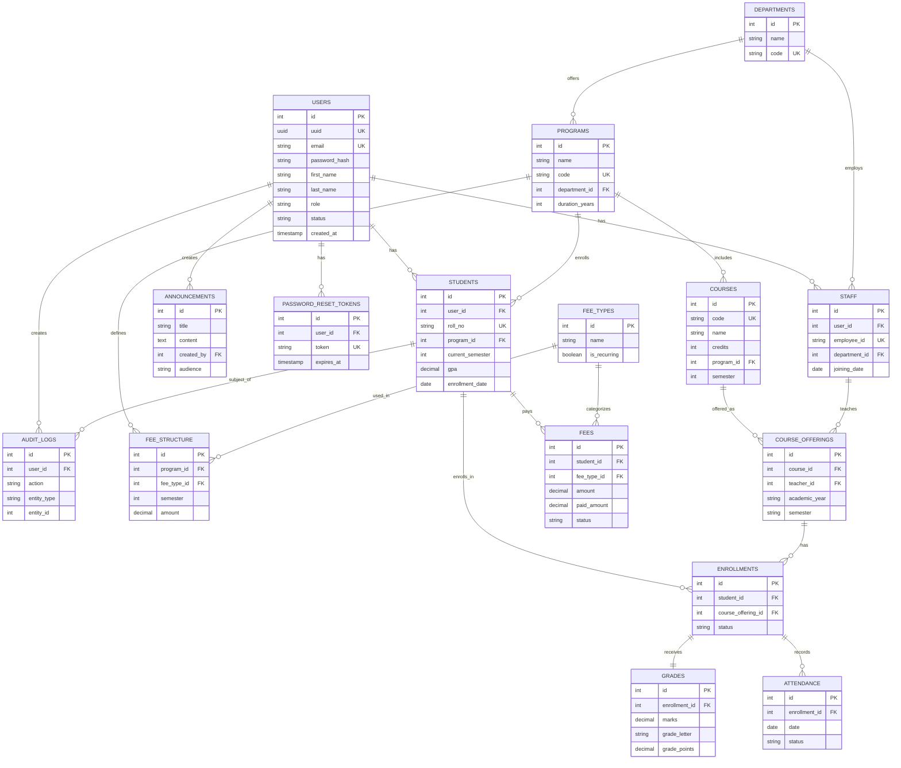

---

## 5. User Role Hierarchy

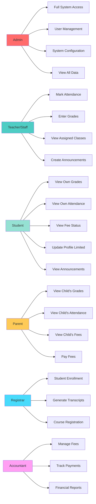

---

## 6. API Request Authorization Flow

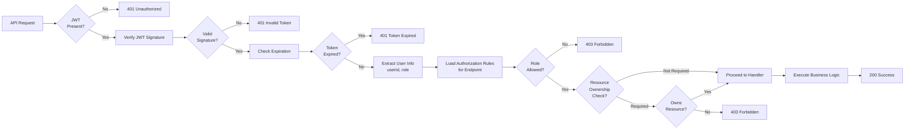

---

## 7. Student Dashboard Data Flow

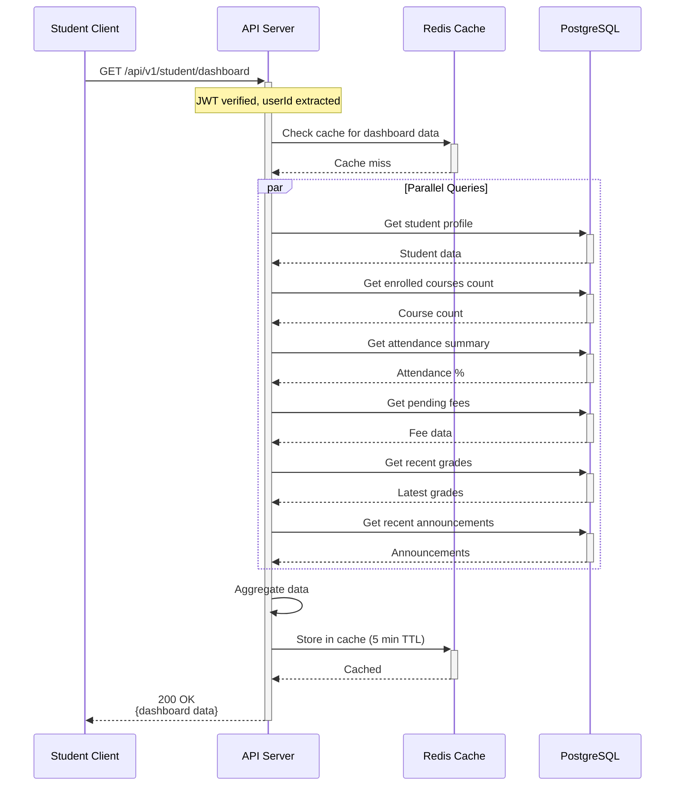

---

## 8. Fee Payment Flow (Future Phase)

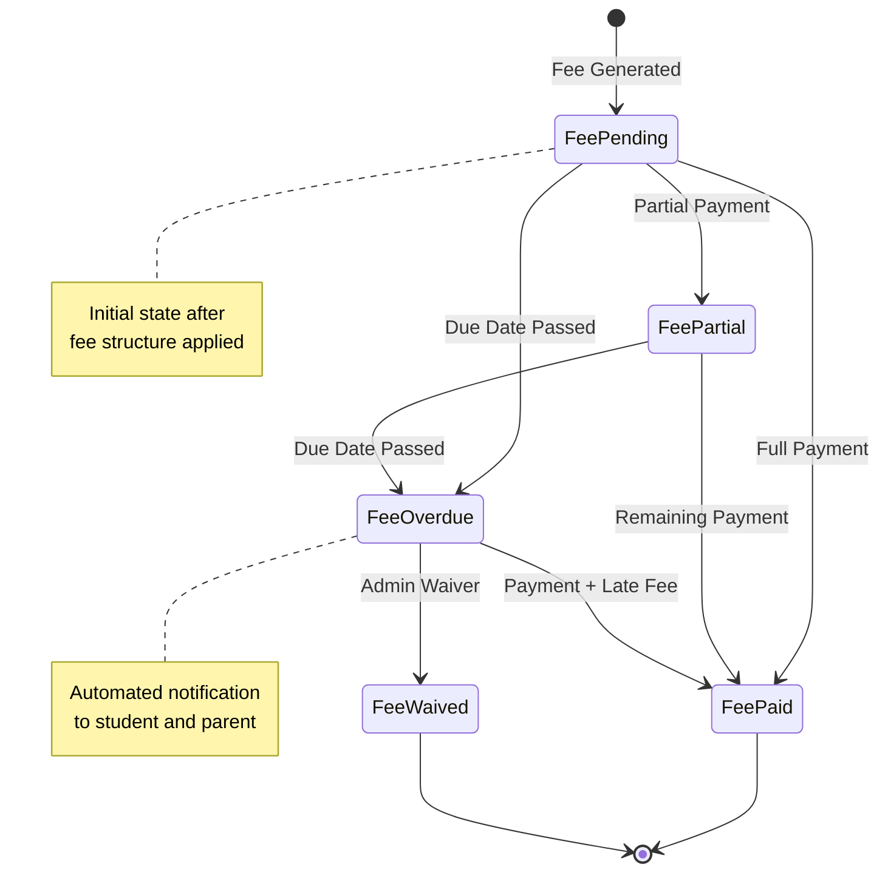

---

## 9. Deployment Architecture

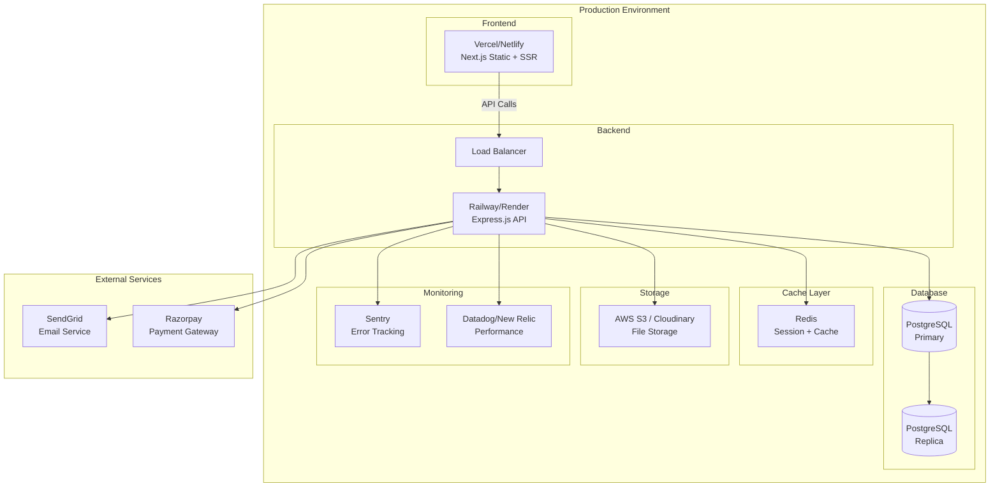

---

## 10. CI/CD Pipeline

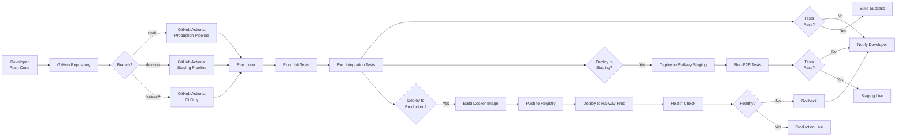

---

## 11. Data Access Pattern (Repository Pattern)

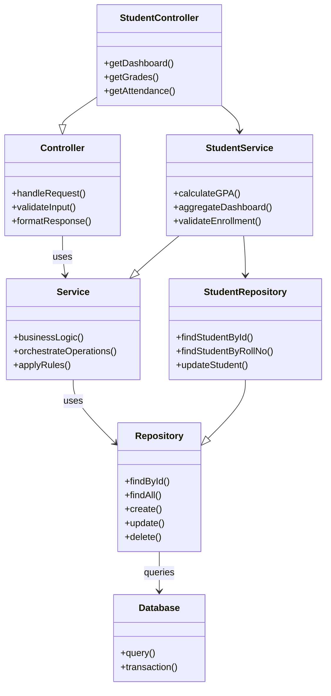

---

## 12. Error Handling Flow

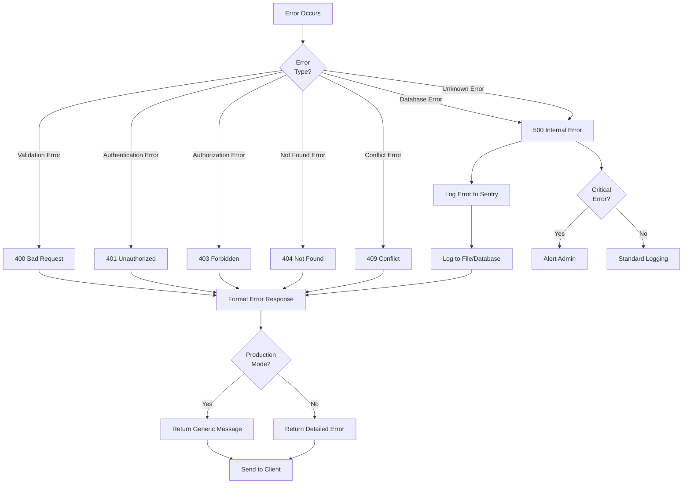

---

## Usage Instructions

To view these diagrams in VS Code:
1. Install the "Markdown Preview Mermaid Support" extension
2. Open this file
3. Press `Ctrl+Shift+V` (or `Cmd+Shift+V` on Mac) to preview

To export diagrams:
1. Use the Mermaid Live Editor: https://mermaid.live/
2. Copy-paste individual diagrams
3. Export as PNG/SVG
